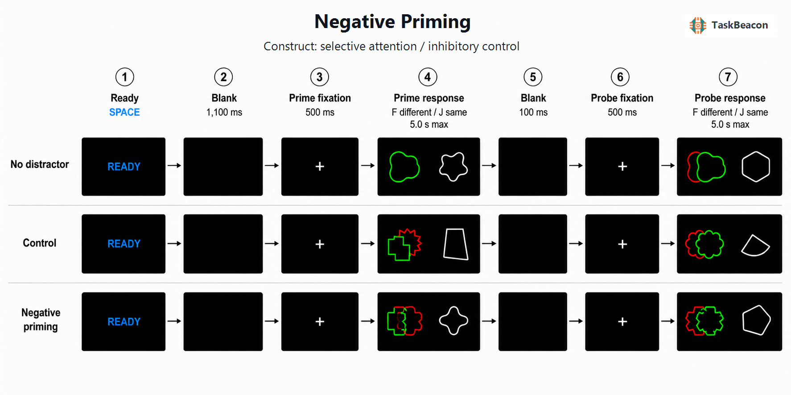

# Negative Priming

| Metadata | Value |
|---|---|
| Name | Negative Priming |
| Version | 0.1.0 |
| Date Updated | 2026-08-23 |
| PsyFlow Version | 0.1.0 |
| PsychoPy Version | 2025.1.1 |
| Modality | Behavioral / keyboard |
| Language | Chinese |
| Task ID | `T000088` |
| Slug | `negative-priming` |
| Variant | `baseline` |
| TAPS Contract | `v0.2.0` |

## 1. Task Overview

This task measures identity negative priming: responses may slow when a shape
that was just ignored as a distractor becomes the target on the next display.
The implementation follows the nonverbal shape-matching procedure reported by
Friedman and Miyake (2004). On each display, participants compare a green target
outline on the left with a white reference outline on the right while ignoring
an overlapping red distractor.

The primary score is the median correct probe reaction time in negative-priming
pairs minus the corresponding median for control-distractor pairs. Positive
values indicate slower responses after ignored repetition, but the score should
not be interpreted as a process-pure measure of inhibition because episodic
retrieval and feature-binding mechanisms can also contribute.

## 2. Task Flow



### Block-Level Flow

The human profile begins with 36 practice prime-probe pairs, followed by four
blocks of 42 experimental pairs. Each block contains 14 `no_distractor`, 14
`control`, and 14 `negative_priming` pairs. A self-paced break separates blocks.

### Trial-Level Flow

Each logical trial is one prime-probe pair:

1. Blue ready prompt; SPACE starts the pair.
2. Black blank screen for 1,100 ms.
3. Prime fixation for 500 ms.
4. Prime shape-matching display until response (5 s safety ceiling).
5. Black inter-display interval for 100 ms.
6. Probe fixation for 500 ms.
7. Probe shape-matching display until response (5 s safety ceiling).

The response rule is identical on prime and probe: `F` means the green target
and white reference differ; `J` means they are the same. In the critical
negative-priming condition, the ignored red prime shape becomes the green probe
target. Control probes use shapes unrelated to the preceding prime.

### Controller Logic

There is no adaptive controller. `src/utils.py` preplans balanced, seeded shape
identities and correct responses. A custom generator is necessary because item
identity constraints span both displays within a pair.

### Other logic

The generator prevents current probe identities from reappearing in the next
pair's prime display and keeps condition counts fixed. The primary RT summary
uses only pairs with correct prime and probe responses.

## 3. Configuration Summary

### a. Subject Info

| Field | Value |
|---|---|
| Participant ID | Three-digit integer, 101-999 |
| Default language | Chinese |
| Input modality | Keyboard |

### b. Window Settings

| Parameter | Value |
|---|---|
| Resolution | 1280 x 800 |
| Units | Visual degrees |
| Background | Black |
| Human mode | Fullscreen |
| Monitor width / distance | 35.5 cm / 57 cm |

### c. Stimuli

| Element | Configuration |
|---|---|
| Target | Green irregular outline, left at `[-3.8, 0]` |
| Distractor | Red irregular outline, overlapping target |
| Reference | White irregular outline, right at `[3.8, 0]` |
| Shape pool | Eight config-defined abstract outlines |
| Occlusion | Red distractor drawn first; green target drawn last |

### d. Timing

| Phase | Duration |
|---|---:|
| Ready-to-prime blank | 1.100 s |
| Prime fixation | 0.500 s |
| Prime response | Until response; 5.000 s ceiling |
| Inter-display blank | 0.100 s |
| Probe fixation | 0.500 s |
| Probe response | Until response; 5.000 s ceiling |

### Triggers

| Event group | Codes |
|---|---|
| Experiment / block | 1, 2, 3, 99 |
| Ready / pre-pair | 10, 11 |
| Prime fixation / onsets | 20, 30-32 |
| Prime response / timeout | 33-35 |
| Inter-display blank | 40 |
| Probe fixation / onsets | 50, 60-62 |
| Probe response / timeout | 63-65 |

### Adaptive controller

Not applicable. The task is nonadaptive and uses deterministic block seeds.

## 4. Methods (for academic publication)

Participants completed a computerized identity negative-priming shape-matching
task adapted from Friedman and Miyake (2004). Each logical trial consisted of a
prime display followed by a probe display. On each display, an abstract green
outline target appeared left of center, either alone or superimposed on a red
outline distractor, and a white reference outline appeared right of center.
Participants pressed F when the green and white shapes differed and J when they
matched. Each pair began with a self-paced readiness prompt, followed by a
1,100-ms blank interval, 500-ms fixation, prime response display, 100-ms blank
interval, 500-ms fixation, and probe response display. Response displays ended
at response, with a 5-s implementation ceiling.

The experiment contained 168 pairs: 56 no-distractor, 56 control-distractor, and
56 negative-priming pairs. In negative-priming pairs, the prime distractor was
repeated as the probe target. In control pairs, probe target and distractor
identities were unrelated to prime identities. Shape assignments, match status,
and pair order were determined before each block from reproducible seeds. The
primary negative-priming measure was the difference between median correct probe
RTs for negative-priming and control pairs after excluding pairs with an error or
timeout on either display.

### References

- Friedman, N. P., & Miyake, A. (2004). The relations among inhibition and interference control functions: A latent-variable analysis. *Journal of Experimental Psychology: General, 133*(1), 101-135. https://doi.org/10.1037/0096-3445.133.1.101
- Kane, M. J., May, C. P., Hasher, L., Rahhal, T., & Stoltzfus, E. R. (1997). Dual mechanisms of negative priming. *Journal of Experimental Psychology: Human Perception and Performance, 23*(3), 632-650. https://doi.org/10.1037/0096-1523.23.3.632
- Fox, E. (1995). Negative priming from ignored distractors in visual selection: A review. *Psychonomic Bulletin & Review, 2*, 145-173. https://doi.org/10.3758/BF03210958
- Frings, C., Schneider, K. K., & Fox, E. (2015). The negative priming paradigm: An update and implications for selective attention. *Psychonomic Bulletin & Review, 22*, 1577-1597. https://doi.org/10.3758/s13423-015-0841-4

## Running

```powershell
python main.py human
python main.py qa --config config/config_qa.yaml
python main.py sim --config config/config_scripted_sim.yaml
python main.py sim --config config/config_sampler_sim.yaml
```
